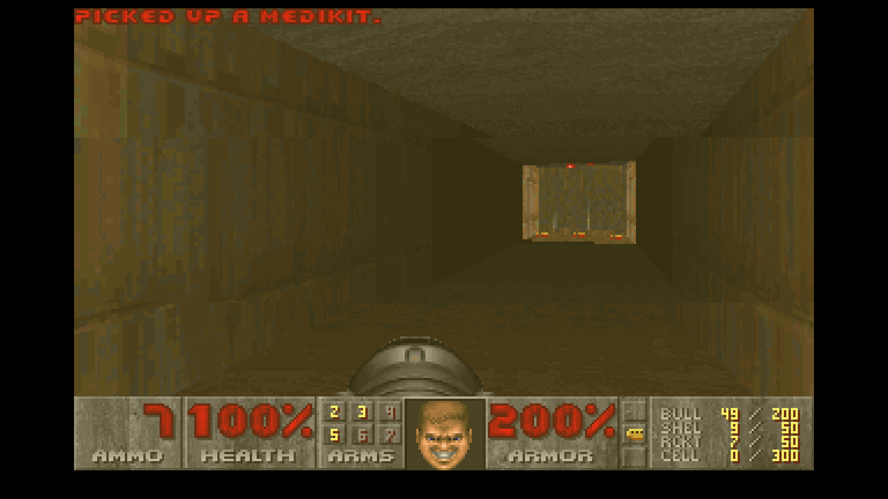

# ZapOS

A from-scratch 32-bit x86 operating system: custom bootloader integration,
kernel, memory manager, drivers, and GUI — no Linux kernel, no libc, no
existing OS underneath it. It boots as a bootable `.iso` in QEMU/VirtualBox.

This is a first milestone, not a finished "everyday OS." Realistically,
matching a modern desktop OS (real filesystem, full TCP/IP + wifi, GPU
drivers, audio, app ecosystem) is a multi-year effort even for full teams
(see SerenityOS, Haiku, ReactOS). What's here is a solid, working foundation
you can keep building on.

## What's implemented

- **Boot**: GRUB (Multiboot2) loads the kernel and hands it a linear
  graphics framebuffer — no real-mode VBE/VGA BIOS calls needed.
- **Core kernel**: GDT, IDT, ISR/IRQ dispatch, 8259 PIC remapping, PIT timer.
- **Memory**: physical frame bitmap allocator, paging (4 GiB identity-mapped
  via 4 MiB PSE pages), a first-fit `kmalloc`/`kfree` kernel heap (32MB —
  sized to comfortably outlive the framebuffer's own back buffer, which
  at 1920x1080x32bpp is already ~8MB on its own, on top of everything
  else — browser fetch/image buffers, the JS arena, FAT32/audio
  buffers — sharing the same arena).
- **Drivers**: PS/2 keyboard (scancode set 1 → ASCII, shift/caps/ctrl
  state) and PS/2 mouse (relative packet decoding, button state).
- **Graphics**: linear framebuffer primitives (pixels, rects, lines, filled
  triangles, alpha blending, gradients, RGB image blits) with an embedded
  8x8 bitmap font. Boots at 1920x1080 if the host/hypervisor's VBE modes
  support it (GRUB reports back whatever it actually granted, which the
  kernel uses as-is — every part of the GUI reads the real width/height
  at runtime instead of assuming a fixed size).
- **GUI**: a compositor with a themed desktop background, draggable
  windows with title bars/close buttons (a real X, not just a colored
  square)/drop shadows, a taskbar with a live clock and a dock of
  per-app icons (color-coded, dims when closed, click to reopen/focus —
  closing a window only hides it, so the dock is also the only way to
  bring one back), and a custom-drawn cursor. Double-buffered to avoid
  tearing.
- **Preemptive multitasking**: a real scheduler with independent kernel
  stacks per task, driven off the PIT timer interrupt — tasks are switched
  transparently, not cooperatively. See "How the scheduler works" below.
- **Ring-3 user mode**: a TSS and an `iret`-based ring0→ring3 transition.
  A demo task genuinely executes at CPL 3 (privileged instructions like
  `in`/`out` would fault there) and runs alongside the GUI and the kernel
  tasks.
- **Syscalls**: an `int 0x80` gate (DPL 3, so ring-3 code can invoke it)
  with `write`/`yield`/`exit` — the only way ring-3 code can talk to the
  kernel. The GUI's "Process Monitor" window shows this live: task count,
  a live-incrementing counter from a background kernel task, and the
  actual string the ring-3 task sent via syscall.
- **Networking**: PCI enumeration, two NIC drivers — an RTL8139 driver
  (IRQ-driven RX ring + TX descriptors, I/O-space registers) and an
  Intel 8254x ("e1000") driver (MMIO registers, descriptor rings the
  hardware DMAs into/out of directly) — tried in that order at boot, so
  whichever one actually finds hardware wins; QEMU defaults to RTL8139,
  VMware's virtual NICs and QEMU's own `-device e1000` show up as e1000.
  `net_init()` doesn't hardcode either driver into the rest of the
  stack: `net_send_frame()` dispatches to whichever one initialized
  successfully, and the GUI's "Network" window shows the real driver
  name it's using. On top of that, a real stack built up in layers — Ethernet, ARP
  (request/reply, with a cache), IPv4 (with header checksums *and*
  gateway routing for off-subnet destinations), ICMP echo, UDP, a DNS
  resolver (A records, over UDP/53), and a client-only TCP (active-open
  connect/send/recv/close with a real handshake and stop-and-wait
  retransmission). A background task resolves the gateway and pings it
  once a second; the GUI's "Network" window shows the NIC's real MAC,
  our IP, the resolved gateway, and live ping stats. Verified against a
  real packet capture (see "How networking works" below) — the gateway's
  replies genuinely round-trip.
- **A real DHCP client** (`net/dhcp.c`): a genuine DISCOVER → OFFER →
  REQUEST → ACK handshake (RFC 2131) over raw broadcast Ethernet frames,
  replacing the old hardcoded static IP. Runs once at boot, right after
  interrupts are enabled; if no DHCP server answers within a few
  retries, it just leaves the static fallback config in place, so
  `make run` still works out of the box either way. See "How DHCP
  works" below.
- **A real web browser with a CSS box-model layout engine**: an HTTP/1.1
  client on top of TCP (handles both `Content-Length` and chunked
  transfer-encoding, and transparently caches cacheable responses in
  memory -- see "How the browser cache works" below), a real DOM tree
  parser (`net/dom.c`), a CSS parser and cascade (`net/css.c`, a UA
  default stylesheet plus a page's own `<style>` blocks, external `<link
  rel="stylesheet">` sheets (fetched over their own HTTP request), and
  inline `style=""`, with real property inheritance, custom-property
  (`var(--name)`) resolution, and a basic `display: flex` row layout --
  see "How the browser works" for exactly how simplified each of those
  is), and a layout engine (`net/layout.c`) that walks the DOM with
  resolved styles into block/inline/flex boxes — real vertical margins
  and padding, explicit `width`/`height`, a simplified `float:
  left`/`right` (content narrows around an active float and flows back
  to full width once it clears — see "How the browser works" for the
  exact simplification), block-level background colors, `<hr>` rules,
  list-item bullets, per-word wrapped individually-colored text runs,
  and `` — fetched over HTTP and decoded if it's a BMP (see
  `net/bmp.c`; no JPEG/PNG/GIF decoder exists, a deliberate scope limit
  same as WAV-only audio), sized to its natural dimensions or an
  explicit CSS `width`/`height`, broken-image gray box if it isn't. This
  is enough real CSS support to pull actual readable content out of a
  modern, framework-generated page (Next.js/Tailwind-style minified CSS,
  including its `:root`-defined theme variables and flex rows) even
  though the page won't look pixel-right -- there's still no web font
  loading, no JPEG/PNG images, and no canvas/JS-rendered content (see
  "What's stubbed" below).
  Links (and linked images) are genuinely clickable: clicking one
  resolves the href (relative, absolute-path, or absolute-URL) against
  the current page and navigates. Fetching something that *isn't* HTML
  (by `Content-Type`, or the URL's extension as a fallback) doesn't try
  to render it — it gets saved straight to the FAT32 disk instead, so a
  song, video, or any other file you point the browser at ends up as a
  real file in the File Manager. The GUI's "Browser" window has a real
  address bar (with optional `host:port`); press Enter and it resolves
  DNS, opens a TCP connection, fetches, and either lays out or
  downloads. Verified end-to-end against both real, live websites and a
  local multi-page CSS test site (see "How the browser works" below).
- **A real JavaScript engine**: a from-scratch lexer, recursive-descent
  parser, and tree-walking interpreter (`js/`) for a pragmatic ES5-ish
  subset — variables (`var`/`let`/`const` with real block scoping),
  functions with genuine closures, `if`/`for`/`while`, all the standard
  operators, array/object literals — wired to a minimal but real DOM API
  (`document.getElementById`, `element.textContent`/`innerHTML` get and
  set, `element.style.property = ...`, `element.onclick = fn` with
  event bubbling, `console.log`, `Math`). Inline `<script>` bodies run
  once after the page's DOM is parsed but before its first layout (so
  a script can build page content before anything is ever drawn), and
  clicking an element re-invokes its registered handler and re-lays-out
  the page live if the handler mutated the DOM — a JS-driven counter
  button and a click-to-recolor button both work for real, closures
  and all (see "How the JS engine works" below). Numbers are 32-bit
  integers only, not IEEE754 doubles — this kernel is built with
  `-mno-80387 -mno-sse`, so no FPU/SSE state is ever initialized and
  floating point genuinely cannot be generated anywhere in it.
- **Audio**: a real AC97 codec driver (`drivers/ac97.c`, bus-master DMA
  via a descriptor list, matching what QEMU's `-device AC97` emulates)
  and a WAV file parser (`drivers/wav.c`). The File Manager can play any
  16-bit/48kHz WAV file on the disk (P to play, S to stop) — genuinely
  through the hardware's DMA engine, not a software mixer. See "How
  audio works" below for how this was actually verified (QEMU's default
  "no backend" audio setup never exposed a real bug that a proper
  backend did) and its real limits (WAV only — no MP3/video decoding of
  any kind exists, or is realistically in scope for a from-scratch OS
  built solo).
- **Filesystem**: an ATA PIO disk driver and a real FAT32 driver (BPB
  parsing, FAT-chain walking, directory listing, file read/write *and*
  creating brand-new files — allocating a free directory entry, or
  growing the directory by a cluster if it's full) on a separate 64MB
  disk image. The GUI's "File Manager" window browses it live — click a
  folder to navigate in, click a file to preview it (or play it, for
  audio), and `NOTES.TXT` is actually editable: type into it, press
  Enter to save, and it persists across a full reboot (verified
  end-to-end, including through the GUI itself — see "How the
  filesystem works"). The listing also shows a live item count and
  color-codes/tags entries by type (directories, `.WAV` audio, plain
  files).
- **Running real programs from disk, genuinely isolated**: a minimal
  ELF32 loader (`kernel/elf.c`) that validates and loads a static
  (`ET_EXEC`) i386 executable's `PT_LOAD` segments and launches it as a
  ring-3 task with its *own private page directory* (`kernel/paging.c`)
  — a loaded program's code/data/stack are backed by physical frames no
  other task's directory maps, and the shared kernel region is present
  but supervisor-only in that directory, so ring-3 code faults
  immediately if it touches kernel memory or another task's private
  frames, instead of silently reading/corrupting them. A ring-3 fault
  (page fault, GPF, anything) now kills just the offending task
  (`kernel/exceptions.c`) instead of halting the whole kernel — verified
  with a deliberately misbehaving test program (`userprogs/evil.c`)
  that tries to write to kernel memory and gets killed cleanly while
  every other task keeps running. The File Manager runs any `.ELF` file
  the same way it opens a `.WAV` or text file (click it;
  `[ELF]`-tagged in the listing). See "How the ELF loader works" below
  for exactly what is and isn't isolated (the compiled-in demo task
  still isn't, deliberately).
- **A real port of DOOM** — the actual id Software game (via the
  `doomgeneric` source tree), not a lookalike, running as `DOOM.ELF`
  through the same File Manager / ELF loader path as any other program.
  Full renderer, fixed-point math, WAD-driven assets, HUD, combat, item
  pickups — see "How the DOOM port works" below for how a game built
  around a real filesystem, libc, and framebuffer got running on a
  kernel with none of those things available to ring-3 code.
- **Serial debug console** (COM1) for early boot logging — see it with
  `make run` or `-serial stdio`.

## What's stubbed / not yet built

- **The JS engine is a pragmatic ES5-ish subset, not real JavaScript**:
  no prototypes/classes, no `try`/`catch`, no template literals, no
  `for-in`/`for-of`, no destructuring, no arrow functions, no
  `Promise`/`async`/`await`, no `setTimeout`/`setInterval` (there's no
  event loop at all beyond "a click runs a handler synchronously"), and
  no `<script src="...">` fetching (only inline `<script>` bodies run —
  an external one is detected and skipped with a log line, never
  fetched). No garbage collector either: everything a page's scripts
  allocate lives in one fixed 256KB arena that's thrown away whole on
  the next navigation, so a script that allocates enough across many
  repeated clicks without ever navigating away could exhaust it (logged
  to serial, not a crash — allocation just starts silently no-opping).
  Numbers are 32-bit integers, not doubles (see above) — arithmetic
  that would produce a fraction in real JS just truncates.
- **No video or compressed-audio playback of any kind**: the browser can
  *download* a `.mkv`/`.mp3`/anything to disk, but nothing on this OS
  can decode video or compressed audio codecs — that's a multi-year
  codec-engineering effort even for established projects, and genuinely
  out of scope here. WAV (uncompressed PCM) is the only playable format.
- **The browser's CSS support is a pragmatic subset, not real CSS**:
  `width`/`height`, a simplified `float: left`/`right`, a simplified
  `display: flex` (row direction only gets its own layout -- see "How
  the browser works" for exactly how simplified each is: one active
  float per side, no side-by-side packing, no `clear`; no `flex-wrap`,
  no real grow/shrink weighting, no `align-items`), and a single
  document-wide `var(--name)` table (populated from `*`/`:root`/`:host`/
  `html`/`body` rules, not real per-element cascading custom
  properties) now exist, but there's still no `inline-block`, no CSS
  `grid`, no centering or automatic horizontal margins, no tables, no
  descendant/child selectors (only bare tag, `.class`, `#id`, and
  `tag.class` -- which, incidentally, is a reasonable fit for
  Tailwind-style atomic utility classes even without descendant
  selectors), no percentage widths, no `<style>` media queries, and no
  `@font-face`/web fonts of any kind (every glyph is the one embedded
  8x8 bitmap font, regardless of what a page's CSS asks for). Images
  are BMP-only (`net/bmp.c`) — no JPEG/PNG/GIF decoder exists, so a
  modern page's actual images always show as a broken-image box, and
  there's no canvas/WebGL of any kind, so anything a page draws via
  `<canvas>` or renders only through client-side JS/React just doesn't
  appear (see "How the browser works" for what a real Next.js/React
  page running into all of this at once actually looks like). There's
  no HTTPS (plain HTTP only — no TLS, so `https://` links are refused
  rather than fetched), the fetch is synchronous and blocks GUI redraws
  while it runs, and only one TCP connection can be open at a time
  (external stylesheets and each image are fetched one at a time,
  sequentially, not concurrently with the page or each other) --
  partially offset by the response cache (see "How the browser cache
  works") when the same URL was already fetched with a cacheable
  `Cache-Control`, but a page's *first* visit still pays for every
  resource sequentially. Downloads are capped at just under 2MB (the
  whole file has to fit in memory at once — no streaming-to-disk) and
  derive their saved filename from the URL path verbatim (no
  percent-decoding). Images are additionally capped at 300KB fetched /
  256x256 decoded (decoded pixels stay resident for as long as the page
  is displayed, on top of everything else sharing the kernel heap), and
  external stylesheets at 128KB (large enough for a real minified
  Tailwind/Next.js bundle, per "How the browser works" below, but still
  a hard cap, not streaming).
- **Filesystem writes still can't delete or rename** — `fat32_write_file`
  can create and overwrite, but there's no way to remove a directory
  entry or grow a file's directory *tree* (only its own cluster chain
  and, for the immediate parent, one additional directory cluster).
- **Incoming packet checksums aren't validated** (outgoing ones are
  computed correctly). TCP is client-only (active-open), single-
  connection (no concurrent sockets) — there's no listening/server side.
- **Real process isolation exists, but only for ELF-loaded programs**:
  each one gets its own page directory (see "How the ELF loader works"
  below) with a private mapping for its own code/data/stack and no
  access to kernel memory or any other task's private frames — a real,
  verified boundary, not just a bounds check. The compiled-in ring-3
  demo task (`kernel/demo_user_task.c`) deliberately still runs in the
  original, fully shared, fully user-accessible address space every
  task used before this existed — it's kernel-authored code the kernel
  already trusts, not something loaded from an untrusted file, so
  giving it the same isolation treatment wasn't the priority; it's a
  documented scope choice, not an oversight. There's also no isolation
  *between* kernel-mode tasks (the background counter task, the ping
  task, the GUI) — they all still share one address space, same as
  before, since none of them run untrusted code either.
- **Process lifecycle**: exited tasks are marked terminated and skipped
  by the scheduler; an isolated ELF-loaded task's private page
  directory, page tables, and frames *are* freed on exit (including
  when it's killed for faulting -- see `paging_free_isolated_directory()`),
  but its kernel-mode stack (kmalloc'd from the kernel heap, like every
  task's) never is, and there's still no `wait()`/parent-child
  relationship, exit codes, or task-slot reuse (`MAX_TASKS = 16` total,
  ever, for the life of one boot -- a long-running system that kept
  launching ELF programs would eventually run out of task slots even
  though their memory is being reclaimed correctly).

- **DOOM has no sound and no windowed mode** — see "How the DOOM port
  works" for the full scope. It's fullscreen-only (takes over the
  whole screen, since there's no general per-window pixel-buffer
  syscall to render into a normal window with) and silent (every sound
  function is a no-op stub; ZapOS's AC97 driver exists and works for
  WAV playback elsewhere, but nothing wires DOOM's mixer into it yet).

See "Roadmap" below for how each of these would actually get built.

## How the scheduler works

Each task (`struct task` in `kernel/scheduler.c`) has its own kernel
stack. `switch_task` (`kernel/switch_task.asm`) is the whole mechanism:
it saves the callee-saved registers of the current task onto its own
stack, records that stack pointer, then loads the next task's stack
pointer and restores its registers. The final `ret` resumes execution
wherever that task last left off — because that's exactly what's sitting
on top of its stack.

The scheduler is invoked from inside the PIT timer interrupt handler
(`schedule()` is registered via `pit_set_tick_callback`). One critical
detail: the interrupt's EOI is sent to the PIC *before* the handler runs
(see the comment in `kernel/idt.c`), not after — because a task switch
means control never unwinds back to the normal interrupt epilogue for the
task being switched away from; it resumes some *other* task's previously
suspended call chain instead. Sending EOI early was the single trickiest
bug in this milestone: without it, the PIC considers the first timer
interrupt permanently "in service" and never delivers IRQ0 again, silently
freezing the whole system after exactly one task switch.

Brand-new tasks are bootstrapped with a fake initial stack frame (built in
`task_create`) that makes `switch_task`'s `ret` land in
`task_trampoline.asm`, which re-enables interrupts (a real interrupt
return via `iret` would have restored `EFLAGS.IF` automatically, but a
freshly created task has never gone through that path) and then calls the
task's real entry point. Ring-3 tasks route through an extra `user_task_shim`
that calls `enter_usermode.asm` to `iret` into CPL 3 with a separate user
stack; the kernel stack is kept around too, since the CPU needs it (via
the TSS's `esp0`) the moment that task takes an interrupt or syscall back
into ring 0.

## How networking works

`drivers/pci.c` enumerates the PCI bus (legacy 0xCF8/0xCFC config-space
access) to find a NIC. `net_init()` tries two drivers in order and uses
whichever one actually finds hardware:

- `drivers/rtl8139.c` — vendor 0x10EC, device 0x8139 (what QEMU's
  `-device rtl8139`, and its default NIC, emulate). I/O-space registers
  (BAR0's low bit marks it as an I/O-space BAR); resets it, gives it a
  receive ring buffer and four transmit descriptor slots, hooks its PCI
  interrupt line.
- `drivers/e1000.c` — Intel 8254x-family (vendor 0x8086, checked against
  a list of common device IDs — QEMU's `-device e1000` shows up as
  82540EM/0x100E, VMware's virtual "E1000" NIC as 82545EM/0x100F, plus a
  handful of others). Memory-mapped registers instead of I/O ports —
  BAR0 is used directly as a pointer, relying on this kernel's flat
  identity-mapped address space rather than a separate MMIO remap step.
  Resets it, zeroes the required multicast table, sets up 32 RX and 8 TX
  descriptors (16-byte-aligned, which `kmalloc()` doesn't guarantee on
  its own — see the aligned-allocation note in the source), and reads
  the MAC straight from the receive-address registers (RAL0/RAH0, which
  QEMU and VMware both pre-load) rather than doing an EEPROM read.

Neither driver is referenced by name outside `net_init()`: `net/ethernet.c`
calls `net_send_frame()`, which dispatches to whichever driver
initialized successfully, and the GUI's "Network" window displays
`net_get_driver_name()` rather than a hardcoded label. `net/` layers
Ethernet → ARP → IPv4 → ICMP on top of whichever NIC is active, each in
its own file, dispatching by ethertype/protocol number. `net_init()`
starts every consumer off with a static fallback config
(`10.0.2.15`/gateway `10.0.2.2`, matching QEMU SLIRP's defaults) so
nothing has to wait on a network round-trip just to boot; a real DHCP
handshake (see "How DHCP works" below) then runs once interrupts are on
and upgrades that config in place if a server answers, which is what
makes this actually work on a real (non-SLIRP) network like VMware's,
not just QEMU's default setup.

Verifying this actually worked took a real packet capture (`tcpdump -r`
on a `-object filter-dump` pcap), which is worth calling out because it
caught two real concurrency bugs that pure code review missed — both are
consequences of preemption happening on *every* PIT tick, unconditionally:

1. **A frozen system, again.** `task_exited()` (used for both a normal
   ring-3 `exit` syscall and a kernel task returning normally) loops
   forever and never reaches an `iret`. But `switch_task` only saves/
   restores four callee-saved registers — never `EFLAGS`. Every task that
   was ever interrupted by a real hardware interrupt has `IF=1` baked into
   its own saved trapframe, restored automatically when it eventually
   `iret`s. A task stuck in `task_exited()`'s loop never does that, so it
   permanently carries whatever `IF` happened to be when the interrupt
   gate that got it there was entered — 0. The first time that zombie task
   got rescheduled, it ran, hit its own `hlt` with interrupts disabled,
   and froze the machine for good (a real timer tick that had already
   fired stayed masked forever, since `hlt` with `IF=0` only wakes on an
   NMI). Fixed with an explicit `sti` at the top of `task_exited()`.
2. **Pings that should have worked, silently didn't.** A packet capture
   showed the gateway replying correctly, with matching IDs and sequence
   numbers, in well under a millisecond — faster than our own sender task
   could get scheduled back in to finish updating its own bookkeeping.
   `icmp_send_echo_request` recorded "reply we're expecting" *after*
   calling `ip_send()`; the RX interrupt for the reply (handled
   independently of whichever task is current) could get serviced first,
   see `pending_outstanding` still 0, and silently drop a perfectly valid
   reply. Fixed by setting that state *before* sending.

## How DHCP works

`net/dhcp.c` runs a real RFC 2131 handshake — DISCOVER, then REQUEST
once an OFFER comes back, waiting (with a timeout) for an ACK — up to
three attempt cycles before giving up. It deliberately doesn't go
through `ip_send()`/`udp_send()`: both assume a usable source IP and an
ARP-resolvable unicast destination, neither of which exist before a
lease does, so DHCP hand-builds its own Ethernet+IP+UDP+DHCP frames and
sends them straight to `eth_send()` with the all-ones broadcast MAC as
the destination, skipping ARP and routing entirely. The blocking
wait-for-reply loop is the same pattern `net/dns.c` already used
(register a UDP port handler, send, then `hlt` in a loop bounded by
`pit_ticks()`), which is also why `net_dhcp_negotiate()` can't run
until *after* `sti` — `net_init()` itself runs earlier, with interrupts
still off, so it only ever sets up the static fallback, never DHCP.

Two bugs got caught by reasoning through the concurrency model before
they ever had a chance to show up in testing, rather than by observing
a failure:

1. **A stale gateway in the ping task.** `ping_task_entry()` originally
   read `net_get_gateway_ip()` once before its loop. But `ping_task` is
   `task_create()`d *before* `net_dhcp_negotiate()` runs, and the
   scheduler is already preempting by the time DHCP's blocking call
   executes — so a DHCP-negotiated gateway that arrived after the ping
   task's first (and only) read would've been silently invisible to it
   forever. Fixed by re-reading the gateway fresh every loop iteration.
2. **Stale options bleeding across retry attempts.** The parsed OFFER
   fields (subnet mask, router, DNS server, server id) are module-level
   statics, reused across the up-to-three DISCOVER→REQUEST attempts in
   `net_dhcp_negotiate()`. If attempt 1 got as far as an OFFER but never
   completed the REQUEST/ACK round-trip, and attempt 2 got a lease from
   a *different* server, that second server's ACK might not repeat
   every option — silently leaving attempt 1's stale values mixed into
   the lease actually accepted. Fixed by resetting all four fields to 0
   at the top of every attempt.

Verified end-to-end in QEMU against both the RTL8139 and e1000 drivers:
the serial log shows `dhcp: leased 10.0.2.15 gateway=10.0.2.2
mask=255.255.255.0` on the first DISCOVER in both cases (QEMU SLIRP's
DHCP-assigned address happens to be identical to the old static
fallback, so this also confirms zero regression), pings kept working
with zero drops after negotiation, and a full browser fetch (external
CSS + an image, over both drivers) rendered identically before and
after switching from the static config to a negotiated one.

## How the ELF loader works

`kernel/elf.c` parses a 32-bit ELF header and program header table
already sitting in memory (read whole off the FAT32 disk by the File
Manager) and is deliberately narrow about what it accepts: only a
static `ET_EXEC` (no PIE/shared/relocatable), 32-bit little-endian,
`EM_386` executable, with every `PT_LOAD` segment's `p_vaddr`/`p_memsz`
(and the entry point) bounds-checked against a fixed window
(`USER_LOAD_MIN`/`USER_LOAD_MAX`, 64MB-240MB) before anything is
touched. 64MB was picked because the kernel's own static footprint
(code, data, and its 32MB heap arena) measures to `kernel_end ≈
33.24 MiB` (`nm build/kernel.elf`); 240MB leaves headroom under the
256MB QEMU is run with. A user program's own linker script has to
target that same base by convention (see `userprogs/user.ld`).

Unlike the first version of this loader, that window is no longer
shared, borrowed storage every task reaches into with a plain
`memcpy` — each loaded program gets its own private address space:

- **`kernel/paging.c`** gained a real page-directory/page-table API on
  top of the existing 4MB-page identity map: `paging_new_isolated_directory()`
  builds a fresh directory that identity-maps all of physical memory
  the same way the original one does, but **supervisor-only** (no user
  bit) — so kernel code (interrupts, syscalls, the scheduler) keeps
  working no matter which task's directory is loaded, while ring-3 code
  running under it faults immediately on touching any of it.
  `paging_map_user_page()` then punches a private, user-accessible 4KB
  mapping into that directory wherever a specific program actually
  needs one (its segments, and a small reserved stack region near the
  top of the window) — a fresh page table replaces the restricted
  identity super-page for just that 4MB region on first use, backed by
  a physical frame from `pmm_alloc_frame()` that no other task's
  directory points to. Two different loaded programs can both use
  vaddr `0x04000000` and genuinely not see each other's memory, because
  each one's directory maps that address to different physical frames.
- **`kernel/elf.c`** now allocates one fresh frame per page a segment
  actually spans (zeroed, then whatever part of it overlaps the
  segment's file-backed range is `memcpy`'d in — BSS stays zero for
  free), maps each into the new directory, then does the same for a
  private stack, and starts the task via the new
  **`task_create_user_isolated()`** instead of the plain
  `task_create_user()` the compiled-in demo task still uses.
- **`kernel/scheduler.c`**'s `struct task` carries a `page_dir_phys`
  field now; `schedule()` reloads `CR3` to whichever directory the next
  task should run under on *every* switch (a cheap register write even
  when it's "the same" directory, and the TLB flush that comes free
  with it is exactly what makes two tasks mapping the same vaddr to
  different frames actually work). On exit,
  `paging_free_isolated_directory()` walks the directory, frees every
  private frame and page table it finds, and frees the directory itself
  — repeated launches don't leak physical memory.
- **`kernel/exceptions.c`** used to `cli; hlt` forever on *any* CPU
  exception, kernel or ring-3. That's fine for a genuine kernel bug,
  but it meant an isolated task hitting its own sandbox boundary (a
  page fault touching kernel memory, say) would take the *entire
  machine* down with it — isolation that faults safely into a total
  freeze isn't durable isolation. Now a fault whose saved `CS` shows it
  came from ring 3 kills just that task (the same `task_exited()` path
  a normal `sys_exit` uses, which is also where the cleanup above
  runs) and lets everything else keep running; only a fault that
  originated in the kernel itself (ring 0) still halts, since that
  really is unrecoverable.

**Verification.** `userprogs/hello.c` (built into `TEST.ELF`) is the
well-behaved case — unchanged behavior from before, just now running in
its own address space: serial log shows `elf: loaded, entry=4000000
pid=N` followed by its five `sys_write` lines and a clean `scheduler:
task pid=N exited`. `userprogs/evil.c` (built into `EVIL.ELF`) is the
adversarial case, written specifically to prove containment isn't just
theoretical: it prints one message, then writes to `0x00100000` —
comfortably inside the kernel's own image, present in every directory,
but supervisor-only. The actual QEMU run:

```
scheduler: created isolated user task pid=5
elf: loaded, entry=4000000 pid=5 (isolated address space)
[pid 5 syscall] EVIL.ELF: about to touch kernel memory at 0x00100000...

*** CPU EXCEPTION 14 (Page fault) ***
err=7 eip=400000f cs=1b eflags=200206 cr2=100000
*** killing pid 5 for this (ring-3 fault contained) ***
scheduler: task pid=5 exited
icmp: echo reply from id=48879 seq=508 rtt=0ms
```

`err=7` decodes to present + write + user — exactly the write EVIL.ELF
attempted, correctly rejected. `EVIL.ELF`'s *second* message ("if you
see this, isolation FAILED") never printed, and ping kept replying
(508 and counting) without so much as a hiccup: one task did something
illegal, the kernel contained it, everything else never noticed.
Launching `TEST.ELF` again afterward (pid 6) worked identically to the
first time, confirming the killed task's resources were reclaimed
cleanly rather than leaving the allocator in a bad state.

**What's deliberately still out of scope.** The compiled-in ring-3
demo task (`kernel/demo_user_task.c`) still runs in the original,
fully shared, fully user-accessible address space every task used
before any of this existed — relocating it into the same isolated
scheme would mean either giving it a narrow, special-cased exception
to the kernel's now-supervisor-only memory (defeating a lot of the
point) or turning it into a real position-independent relocation
target (a correctness minefield for ordinary compiler output, which
bakes in absolute addresses for things like string literals). Since
it's kernel-authored code the kernel already trusts — not the
security-relevant case — leaving it as-is and spending the effort on
the actually-untrusted case (arbitrary code loaded from a disk file)
was the deliberate call. There's also still no isolation *between*
two kernel-mode tasks (the background counter, the ping task, the
GUI) — none of them run untrusted code, so that gap doesn't matter the
way it would for ELF-loaded ones.

## How the DOOM port works

`userprogs/doom/` is [doomgeneric](https://github.com/ozkl/doomgeneric)
(a fork of the real DOOM source tree, GPL-2.0, restructured so a port
only has to implement six platform functions) minus every platform
frontend and sound backend it ships with, plus a from-scratch libc
(`doomlibc.c`) and a ZapOS platform layer (`doomgeneric_zapos.c`,
`i_video_zapos.c`, `i_sound_zapos.c`) written for this port. It builds
into `DOOM.ELF` and runs exactly like `TEST.ELF` — click it in the File
Manager — with the shareware IWAD linked directly into the binary.

**No FPU, at all.** The kernel (and every user program) is built
`-mgeneral-regs-only -mno-sse -mno-80387`, which makes any `float`/
`double` a hard compile error the instant it's *declared or called*,
never mind executed — the ABI itself needs FPU/SSE registers to pass
or return one. DOOM's renderer and game logic turned out to already be
entirely fixed-point at runtime (`tables.c`'s precomputed trig tables
replace the `#if 0`-guarded `sin`/`cos`/`atan` calls in `r_main.c`), so
the only real float usage was in code this port doesn't need at all:
every sound backend (excluded wholesale) and a handful of
config-system/UI conveniences — `mouse_acceleration`, `v_video.c`'s
mouse-speed-box display, `g_game.c`'s demo-timing fps readout — which
got stubbed or rewritten in integer math rather than ported.

**No filesystem, no config files, no libc.** Three things made this
tractable instead of requiring real file I/O syscalls:
- The shareware `doom1.wad` is linked straight into `DOOM.ELF`'s data
  section (`ld -r -b binary`, giving `_binary_doom1_wad_start/end`
  symbols) and served by a from-scratch `wad_file_class_t` backend
  (`w_file_zapos.c`) that just points at that embedded blob — no
  `open`/`read` syscall exists or needs to.
- `d_iwad.c` and `m_config.c` (IWAD path resolution and the
  float-laden generic config-variable system, respectively) are
  replaced with minimal stubs — safe because `D_IdentifyVersion()`
  auto-detects the actual game version from the WAD's real lump names
  (`E1M1`, `MAP01`, ...), not from whatever path `D_FindIWAD` returns,
  and there's nowhere to persist a config file to anyway.
- `doomlibc.c` is a ~600-line freestanding libc built for exactly what
  DOOM's source calls: a first-fit `malloc` over a static 48MB arena
  (sized well past DOOM's own 16MB zone allocator plus WAD lump
  caching), the string/mem functions, and a `printf` family with a
  custom `vsnprintf` — including integer-conversion *precision*
  (`"%.3d"`), which turned out to matter: `hu_stuff.c` builds HUD font
  lump names as `STCFN%.3d`, and an early version of this without
  precision support produced `STCFN33` instead of `STCFN033`, which
  silently failed the lump lookup. `stdio`/`FILE*` calls (`fopen` etc.)
  are honest, permanent failures, not TODOs — there's no file to open.

**No display, no keyboard, from ring 3.** ZapOS's GUI is a windowed
desktop with no general "give me a window's pixels" syscall, so DOOM
gets a dedicated one instead: `SYS_BLIT` (`kernel/syscall.c`) copies a
caller-owned `320x200` `uint32_t` buffer into a kernel-owned staging
buffer and flips the compositor into fullscreen-takeover mode
(`gui/compositor.c`'s `draw_frame()` checks a `fs_active` flag first
and, when set, scales/letterboxes that buffer to the real screen
instead of drawing the desktop) until the owning task exits. Input
works the same way in reverse: `drivers/keyboard.c` already had an
ASCII character ring for text input, but DOOM needs raw press/release
*scancodes* (arrows, ctrl, shift aren't ASCII), so it gained a second,
parallel `(scancode, pressed)` event ring that `SYS_POLL_KEY` drains.
`SYS_GET_TICKS`/`SYS_SLEEP` round out the syscalls, wrapping the
kernel's existing 100Hz PIT for `doomgeneric`'s timing hooks. All four
are read-only or copy-only from the kernel's side, and — since a
syscall trap doesn't switch `CR3` — the handler runs with the calling
task's own isolated page directory still loaded, so it can safely
dereference that task's own buffer pointer without any special-casing.

**Verification.** Booted in QEMU, clicked `DOOM.ELF` in the File
Manager, and watched the real init sequence scroll on the serial
console (`Z_Init`, `W_Init: Init WADfiles`, ` adding doom1.wad`,
`R_Init: Init DOOM refresh daemon`, `HU_Init`) before the fullscreen
takeover kicked in showing the actual E1M1 ("Hangar") level, correctly
textured, with a working HUD (ammo/health/armor/face) and an enemy on
screen. Sending keys through it produced real, live gameplay — picked
up a clip, a medikit, and armor (HUD updating to `100%`/`200%`
correctly), took and dealt damage, and opened/closed the real DOOM
main menu — not a static render, an actually-playable game loop.



**Scope.** This is a v1: fullscreen only (no windowed mode, since the
GUI has no general per-window pixel-buffer API yet), keyboard-only (no
mouse look/strafe), no sound (every `i_sound_zapos.c` function is a
no-op stub — AC97 output exists elsewhere in ZapOS for WAV playback,
but wiring DOOM's sound mixer into it is future work), and the
shareware WAD only (the full retail WAD would work identically, since
nothing here special-cases which WAD is embedded — it's just not
included, for licensing reasons the shareware WAD doesn't have).

## How the browser works

`net/udp.c` adds a small port-based dispatch table (`udp_register_handler`)
on top of IPv4; `net/dns.c` uses it to send an A-record query to QEMU
SLIRP's built-in resolver (`<gateway-subnet>.3`, e.g. `10.0.2.3`) and
blocks (with a timeout, via `pit_ticks()`) waiting for the reply,
including handling DNS name compression pointers in the response.
`net/tcp.c` is a single-connection, client-only, active-open state
machine (`SYN_SENT` → `ESTABLISHED` → `FIN_WAIT1/2` → `LAST_ACK`) with
stop-and-wait retransmission for its *own* sends (write a segment, wait
for its ACK before sending the next one — no congestion control), and a
real (if fixed-size, 32KB) receive window that's actually advertised
and enforced on the receive side — see bugs #5/#6 below for what that
took to get right. `net/http.c` drives the connection to do an HTTP/1.1
GET, and understands both `Content-Length` and chunked
transfer-encoding responses, plus (now) the `Content-Type` header,
which is what the browser uses to decide whether to render or download
a response.

From there, three layers turn the raw HTML bytes into pixels:

- **`net/dom.c`** parses the HTML into a real tree (kmalloc'd nodes with
  a tag, `id`/`class`/`href`/inline-`style` attributes, and text-node
  children) instead of a flat line list — a real (if minimal) DOM.
- **`net/css.c`** parses a pragmatic CSS subset: a hardcoded UA default
  stylesheet (block/inline defaults, heading/link/bold colors, list and
  blockquote spacing) plus whatever the page's own `<style>` blocks and
  inline `style=""` attributes add, resolved with real property
  inheritance and a simple cascade (later rules win per-property; inline
  style wins over everything). `css_resolve_custom_properties()` runs
  once per page (after every stylesheet, including external ones, has
  loaded) and populates one document-wide `--name -> value` table from
  every `*`/`:root`/`:host`/`html`/`body` rule's custom-property
  declarations; `apply_decl()` then resolves any `var(--name)` (or
  `var(--name, fallback)`) it finds in a regular declaration's value
  against that table before parsing it as a color/length/etc. This
  isn't real per-element custom-property cascading -- it's a single
  global table -- but it matches how generated CSS (Tailwind, Next.js,
  shadcn, ...) actually defines its theme in practice: once, at the
  root, referenced everywhere. `display: flex` is also recognized now,
  though only `flex-direction: row` gets a real (if simplified) layout
  pass -- see `net/layout.c`'s `layout_flex_row()` and "How the browser
  works" below for what "simplified" means there. The parser's own
  buffers were also sized for real minified output rather than hand-
  written test pages: a single rule body can run past a kilobyte in
  practice (one universal-selector reset rule in a real Tailwind bundle
  had 58 declarations in it, just to zero out custom properties for
  gradients/shadows/transforms this browser doesn't implement anyway),
  and `CSS_MAX_SELECTOR` grew from 40 to 144 for selector lists that
  run well past what a hand-written stylesheet ever would.
- **`net/layout.c`** walks the DOM with resolved styles into a flat list
  of positioned render items in document-pixel space: block children
  stack vertically with real margins/padding, inline content (text,
  `<a>`/`<b>`/`<span>`) flows and word-wraps within the current block's
  width, and each *word* becomes its own item with its own color and
  link id — which is what makes individual links genuinely clickable
  (hit-testing is just "does the click point fall inside this word's
  box"), not merely styled. `width`/`height` narrow or (as a floor, not
  a hard clip) heighten a block beyond its natural content size.
  `float: left`/`right` is deliberately simplified rather than a full
  CSS float algorithm: each block formatting context tracks at most one
  active float per side, which carves out horizontal space (narrowing
  `x`/`width` for whatever follows) until the flow's own cursor passes
  the float's bottom edge; a second same-side float that starts before
  the first clears stacks *below* it rather than beside it. `` is
  laid out like a sized block (or float) using its decoded BMP's natural
  size, or an explicit CSS `width`/`height` if the page set one.

The GUI's Browser window (`gui/compositor.c`) draws that item list in
three passes (backgrounds, then rules, then text, so a block's own
background never paints over its text regardless of emission order),
and clicking a link resolves its `href` against the current URL
(handling `http://` absolute, `//host/path`, `/path` absolute-path, and
plain relative hrefs, with `#fragment`/`mailto:`/`javascript:` treated as
no-ops and `https://` refused outright — no TLS client exists) before
re-fetching.

Several real bugs surfaced while getting this to render correctly
end-to-end — all caught by actually fetching real pages (both a live
site and a small local multi-page CSS test site) rather than trusting
code review:

1. **DNS silently failed.** `ip_send()` originally only checked the ARP
   *cache* for the next hop and gave up if it missed — fine for the
   gateway (which gets ARP'd by the ping task) but nothing had ever
   ARP'd the DNS server's IP, so every DNS query silently failed to even
   go out. Fixed with `ip_resolve_next_hop()`, which actively sends ARP
   *requests* and retries (5 attempts, 200ms apart) before giving up.
   The same fix made off-subnet routing work in general: `ip_send()` now
   routes through the gateway for any destination outside our `/24`.
2. **A whole class of tags silently rendered as inline text.** The UA
   default stylesheet's `display: block` rule lists ~25 tag names in one
   comma-separated selector (`h1,h2,...,blockquote,...,form`), but
   `css_parse_into` only kept the first 4 comma-separated selectors per
   rule (`CSS_MAX_GROUPS` was 4). Every tag past the 4th silently never
   matched that rule, so `h1`, `ul`, `li`, `hr`, `blockquote`, and more
   all defaulted to `display: inline` — no margins, no backgrounds, no
   line breaks between them, everything ran together as one paragraph.
   Caught by literally walking the DOM tree with debug logging and
   noticing those tags were visited but never reached the block-layout
   code path. Fixed by raising `CSS_MAX_GROUPS` to 32.
3. **The fix above appeared to do nothing at first** — because the
   Makefile's `%.o: %.c` rule has no header dependency tracking, so
   editing `css.h` didn't trigger a rebuild of anything that includes
   it. `make` silently relinked the *old* object file. Fixed by adding
   `-MMD -MP` to `CFLAGS` and `-include`ing the generated `.d` files, so
   header edits now correctly invalidate their dependents. This wasn't
   a browser bug, but it's the kind of thing that makes a real bug look
   fixed when it isn't, so it's worth calling out.
4. **Unstyled pages were invisible.** The UA default text color was a
   light near-white (left over from when the reader-mode renderer only
   ever painted on the OS's own dark window background). Once real CSS
   backgrounds started rendering, a page with a light `background-color`
   but no explicit `color` (e.g. `example.com`, which relies on the
   browser default) produced near-white text on a near-white
   background — unreadable. Real browsers default to *black* text on a
   light canvas; fixed by changing the UA default to black and giving
   the Browser window's own content area a light default fill (drawn
   before any page-supplied background), matching that same convention.

Two smaller bugs were fixed in the reader-mode-era code and are now
moot since that renderer (`net/html.c`) was deleted and fully replaced
by the DOM/CSS/layout pipeline above: a style-flush-ordering bug and a
line-truncation bug in the old flat HTML parser.

Adding downloads (fetching anything non-HTML straight to disk) surfaced
three more real bugs, all in code that pre-dated this pass but had
never been exercised by a transfer bigger than a small HTML page:

5. **Downloads over ~32KB came back silently truncated.** In
   `tcp_handle_packet()`'s `TCP_ESTABLISHED` case, when an incoming
   segment was bigger than the free space left in the 32KB receive
   buffer, the code stored only what fit (`copy_len`) but advanced
   `recv_seq` — and therefore what the ACK it sent claimed to have
   received — by the *full* segment length. That silently acknowledged
   bytes that were never actually stored anywhere, so they were gone
   for good instead of being retransmitted once space freed up. Fixed
   by only advancing `recv_seq` by `copy_len`.
6. **Fixing #5 turned truncation into a permanent hang.** Once the
   receive buffer legitimately filled up, both sides got stuck: the
   real sender was still being told (via a *hardcoded* `window=8192` on
   every segment we sent, success or not) that we always had room,
   so it kept trying to push data we had nowhere to put; meanwhile we
   had no way to tell it "wait" or "you can resume now" once we'd
   drained space, because the window field never reflected our actual
   buffer occupancy. Fixed by computing `hdr->window` from real free
   space (`TCP_RECV_BUF_SIZE - conn.recv_len`) on every segment, so it
   correctly drops toward 0 as the buffer fills and rises again once
   `tcp_recv()` drains it — real TCP flow control instead of a constant
   that happened to work only because nothing had ever filled the
   buffer before.
7. **A large download's failure was completely silent.** Bumping
   `http.c`'s receive buffer to fit bigger responses meant it, the
   browser's own fetch buffer, and anything already loaded (e.g. a WAV
   file open in the File Manager) could collectively exceed the 8MB
   kernel heap — and the lazy `kmalloc()` for that buffer had no log
   line on failure, so `http_get()` just returned 0 with zero
   indication why. This is what actually cost the most time to track
   down (bug #5/#6 above hid behind it at first). Fixed by sizing both
   buffers to comfortably coexist (2MB each) and logging the
   out-of-memory case.
8. **The same class of bug as #7, from a totally different direction:
   bumping the boot resolution broke every page load with "Out of
   memory."** The framebuffer's double-buffer (`gui/framebuffer.c`'s
   `back_buffer`) scales with resolution — at 1920x1080x32bpp it's
   ~8MB on its own, which is the *entire* kernel heap that used to
   exist. Every browser fetch, external stylesheet, and image now had
   nothing left to allocate into. Fixed by growing the heap to 32MB
   (physical RAM was never the constraint — `pmm` routinely reports
   100MB+ free; the heap's *static* 8MB size just predated a
   1920x1080 framebuffer needing to fit in it too).
9. **Verifying this against a real page exposed how fragile the test
   setup's synthetic mouse input was** — QEMU's monitor `mouse_move`,
   driven fast enough (many small steps in quick succession, to type a
   URL into the address bar programmatically), would occasionally land
   short of the intended position, so a click meant to focus the
   address bar sometimes landed on empty desktop instead, silently. Not
   a kernel bug — re-verifying the actual cursor position from a fresh
   screenshot before every click, rather than trusting the requested
   delta, made it reliable. While chasing this down, one genuine kernel
   issue *did* turn up alongside it: like the ATA drive-detection fix
   earlier in this project, nothing ever explicitly unmasked IRQ1
   (keyboard), IRQ2 (the master PIC's cascade to the slave), or IRQ12
   (mouse) — `pic_remap()` just kept whatever mask it inherited from
   the bootloader handoff. That happened to leave them usable on every
   boot tested so far, which isn't the same as being guaranteed to.
   Fixed defensively, the same way as the ATA bug: explicitly unmask
   every IRQ line the kernel actually drives right after initializing
   its driver, instead of trusting an inherited default.

**What actually happens on a real modern (React/Next.js) page.** Tested
against `failure.fail`, a real Next.js/Tailwind site with client-side
React, a canvas-drawn background, custom web fonts, and a ~48KB minified
CSS bundle. The page's own HTML is server-rendered (its real headline,
input box, and suggestion-pill text are all in the initial HTML, not
injected by JS afterward), so the DOM/CSS/layout pipeline above --
including the var()/flex additions -- pulls out genuinely readable text
content: the actual headline and button copy render as real text, laid
out in the right rough shape. What still doesn't work, and isn't
realistically going to without each being its own multi-week project:
the page's PNG logo shows as a broken-image box (BMP-only decoder), none
of its custom web fonts load (everything draws in the one embedded 8x8
bitmap font), and its canvas-drawn animated background and any content
that only exists because client-side JS/React rendered it after the
initial HTML never appears (this browser only runs a page's *inline*
`<script>` tags -- see "How the JS engine works" below -- and has
nothing resembling a React runtime). The honest summary: this is enough
real CSS to make a modern site's actual *content* legible, not enough to
make it look right.

## How the browser cache works

`net/http.c` keeps a small in-memory table (`HTTP_CACHE_ENTRIES = 8`,
each up to `HTTP_CACHE_MAX_BODY = 256KB`) keyed by `host:port+path`.
Every `http_get()` call checks it first -- a hit skips DNS/TCP/HTTP
entirely and returns the cached status/body/Content-Type straight away
(logged as `CACHED` rather than a fresh fetch, so it's visible in the
serial log). After a real fetch, a `200` response whose own
`Cache-Control` header both permits caching (no `no-store`/`no-cache`)
and gives a real `max-age` gets stored, with that `max-age` (converted
to a `pit_ticks()` deadline) as its TTL; a full slot table evicts
whichever entry was least-recently-used.

Deliberately left out, to keep this a same-session, single-feature
addition rather than a second HTTP-caching project: there's no ETag/
`If-None-Match` conditional-GET revalidation, so a resource served
`max-age=0, must-revalidate` (common on CDN-fronted static assets --
`failure.fail`'s own JS/CSS/image chunks are all served exactly that
way) is never cached at all, even though a real browser would still
save the round-trip via a cheap `304 Not Modified`. There's also no
`Expires` header fallback (only `Cache-Control: max-age`) and no
per-origin cache size accounting beyond the fixed 8-entry table. Verified
with a local test server serving a page with `Cache-Control:
public, max-age=120`: the first fetch logged a normal `status=200`, and
a second fetch of the same URL logged `CACHED status=200` with the same
body, with no second DNS/TCP round-trip in between.

## How the JS engine works

`js/lexer.c` tokenizes source into numbers (integers only — see the
FPU note above), strings (with the common escapes), identifiers/
keywords, and operators (longest-match-first, so `===` doesn't get
split into `==` `=`). `js/parser.c` is a straightforward recursive-
descent parser with one function per precedence level (assignment →
conditional → `||` → `&&` → equality → relational → additive →
multiplicative → unary → postfix → primary) producing an AST
(`js.h`'s `struct js_node`, a tagged union). `js/interp.c` walks that
AST against a real scope chain (`struct js_env`, one per function call
and per block — `var` hoists to the nearest function/global scope,
`let`/`const` are block-scoped) with proper control-flow propagation
for `return`/`break`/`continue` threaded back up through nested
statements. Closures work because a function value just carries a
pointer to the `js_env` that was active when it was defined
(`fn->closure_env`), and calling it later builds a fresh call-local env
with *that* as its parent — the classic tree-walking-interpreter
closure trick.

Everything the interpreter allocates (AST nodes, strings, objects,
environments) comes out of one 256KB bump-allocated arena
(`js_alloc()` in `js/value.c`) that's simply thrown away and
re-created on the next page navigation — there's no garbage collector,
and there doesn't need to be one, since nothing a page's scripts
create needs to outlive that page.

`js/dom_binding.c` is the only part that knows about `net/dom.h`: it
wraps a `dom_node*` as a `JS_OBJ_DOM_ELEMENT` value, implements
`document.getElementById` by walking the live DOM tree, and gives
`element.style` its own object kind (`JS_OBJ_DOM_STYLE`) whose
property *setters* rewrite the element's inline style text in place
(converting `backgroundColor` → `background-color` generically, not
via a lookup table) rather than storing arbitrary JS values — so
`this.style.backgroundColor = "..."` genuinely flows through the same
CSS cascade every other background color does. `onclick` handlers are
kept in a small side table keyed by `dom_node*` (a fresh
`JS_OBJ_DOM_ELEMENT` wrapper gets created every time JS code reads
`document.getElementById(...)`, so the handler can't live *on* that
wrapper object — it has to be keyed by the stable node pointer
instead). Dispatching a click walks up the clicked element's `parent`
chain looking for a registered handler (simple bubbling: first handler
found wins, no `stopPropagation`), which is also why `net/dom.c` grew
a `parent` field on `dom_node` in this pass.

The browser (`gui/compositor.c`) now keeps a page's DOM tree and
resolved stylesheet alive for as long as it's displayed (previously
both were freed the instant the first layout finished, since nothing
needed them afterward) so that a click can mutate the live tree and
`br_relayout()` can re-run `layout_run()` against the *same* tree
afterward. Making a specific element clickable at all needed the
layout engine to remember, for every rendered word, which DOM element
it actually belongs to — a small generalization of the link-hit-testing
threading that already existed for `<a>` tags (`net/layout.c`'s
`layout_children` already threaded a `link_id` down through recursion;
this pass added an `owner` pointer alongside it, updated to the current
element at each element boundary during the walk).

Two real, and one very educational, bugs came out of building this:

1. **A `<div>`'s own background color never showed up if any ancestor
   (even `<body>`) also had one.** `net/layout.c` originally appended
   each block's background rect to the render-item list *after*
   laying out its children (since the rect's height isn't known until
   then) — which meant a parent's rect always landed at a *later*
   array index than its children's rects, and the draw loop paints a
   whole pass front-to-back in array order. A later index means
   "painted on top," so any container with its own background
   (`<body>` in particular, since nearly every real page's `<body>`
   sets one) silently painted over every background nested inside it.
   This had been live and wrong since the CSS milestone before this
   one — it just never got *caught*, because the one page that
   exercised it used two similarly dark colors that looked fine at a
   glance in a screenshot. It took a test page with two loudly
   different colors (bright blue and purple) to make the bug
   impossible to miss. Fixed by reserving the parent's rect's array
   slot *before* recursing into its children (so it's always earlier,
   and therefore painted first/underneath), then patching its height
   in place once the real value is known.
2. **`&&`/`||` were being parsed as eagerly-evaluated binary operators**,
   not short-circuiting logical ones — the parser's shared precedence-
   climbing helper always built a `JS_BINARY` node regardless of which
   operator table it was given, so `a && b` would evaluate `b`
   unconditionally (and `eval_binary` didn't even have a case for
   `&&`/`||`, so the result would've been wrong regardless). Caught by
   re-reading the parser before ever running it, not by a failing test
   — fixed by having the shared helper take the AST node type to build
   as a parameter, so the logical-operator levels produce real
   `JS_LOGICAL` nodes that the interpreter actually short-circuits.
3. An `ASSIGN` expression node originally stashed its right-hand side
   in the AST's shared `->next` sibling-link field to avoid growing
   the node's union — which silently breaks the moment an assignment
   appears as, say, a function call argument or array element, since
   *those* also use `->next` to link list items and would have
   clobbered (or been clobbered by) the assignment's own RHS pointer.
   Caught the same way as #2 (re-reading before running), fixed by
   giving `JS_ASSIGN` its own `value` field instead of overloading a
   field with an unrelated meaning.

## How audio works

`drivers/ac97.c` finds the Intel ICH AC97 codec via PCI (vendor
`0x8086` device `0x2415` — what QEMU's `-device AC97` emulates), resets
its mixer, sets both volume registers to max, and drives PCM playback
through the codec's bus-master DMA engine: a buffer descriptor list
(up to 32 entries, each up to ~0.68s of 48kHz stereo audio) point
directly at the already-in-RAM PCM samples (no copying needed — the
whole address space is identity-mapped), and starting playback is just
writing the list's address and length into two registers and setting
the "run" bit. `drivers/wav.c` parses a RIFF/WAVE file's `fmt `/`data`
chunks to hand `ac97_play_pcm()` a pointer straight into the file's own
already-loaded bytes. The driver only supports the format that AC97's
"fixed rate" mode actually runs at — 16-bit, 48000Hz — so
`tools/make_disk_image.sh` generates its demo `SONG.WAV` at exactly
that rate.

The one real bug here is worth calling out because *how* it was found
is the interesting part: the driver initially also enabled
`CR_IOCE` (interrupt-on-completion) on the DMA engine, even though no
interrupt handler was ever registered for it. With QEMU's default "no
audio backend" setup (this container has no real sound card), the
timed DMA never actually advanced far enough to trigger it, so testing
looked fine. Only after explicitly attaching a real backend
(`-audiodev wav,...`, to capture what the guest actually played and
confirm it was real, non-silent audio and not just "the driver claims
success") did the DMA genuinely run long enough to hit a buffer
completion — at which point the codec's (level-triggered, and shared
with the RTL8139's PCI IRQ line on QEMU's default chipset) interrupt
line got asserted and never cleared, since nothing was listening for
it. The whole guest froze silently within about one buffer's playback
time. Fixed by simply not enabling `CR_IOCE` at all — the driver polls
`CIV`/`SR` instead of using interrupts, so it never needed to assert
one in the first place. This is a good example of why "the emulator
didn't complain" isn't the same as "the driver is correct" — the bug
was real and hardware-accurate, just invisible until audio was
verified with an actual backend consuming the DMA output.

## How the filesystem works

`drivers/ata.c` drives the primary IDE channel with plain PIO (IDENTIFY,
then 28-bit LBA read/write) and deliberately only looks at the primary
*master* — the boot CD-ROM is an ATAPI device and gets skipped by
checking the IDENTIFY signature. `fs/fat32.c` reads the BPB from LBA 0
(the companion disk image has no partition table — it's a FAT32
"superfloppy," so the filesystem starts right at sector 0), then
implements the FAT32 essentials from scratch: cluster↔LBA math, walking
a 32-bit FAT chain, directory-entry parsing (8.3 names only — long
filename entries are skipped, not decoded), reading a file's cluster
chain, and writing one (allocate free clusters by scanning the FAT,
chain them, write the data). Writing looks for a directory entry with
a matching name first (overwrite), then falls back to the first free
slot (a deleted or never-used entry) in an existing directory cluster,
and finally to growing the directory by one more cluster if every
existing slot is already taken — real file *creation*, not just
overwriting a name the disk image happened to ship with, which is what
lets the browser save a download under whatever name the URL gave it.

`tools/make_disk_image.sh` builds `zapos_disk.img` (and a `.vmdk`
alongside it for VMware/VirtualBox) with `mtools` — no root or loop
devices needed. It ships `README.TXT`, `DOCS/ABOUTFS.TXT`, an empty
`NOTES.TXT` that the File Manager can actually edit and save, and a
generated `SONG.WAV` test tone (skipped if `python3` isn't available)
for the audio playback demo.

Getting this right needed one more fix on top of everything already
running: with a hard disk attached, the BIOS's default boot order tries
the hard disk *before* the CD-ROM, and since `zapos_disk.img` has no
boot code on it, that's a silent hang before any of our own code even
runs. `-boot order=d` (CD-ROM first) fixes it — `make run` and the
troubleshooting notes below both account for this.

## Testing in other VMs (VMware, VirtualBox, browser-based emulators)

ZapOS is a completely standard Multiboot2 kernel on a standard El Torito
bootable ISO, so it isn't tied to QEMU. It was also verified booting
correctly under [v86](https://github.com/copy/v86) (a WASM x86 emulator
used by some browser-based "run an OS in a tab" tools) — GUI, scheduler,
ring-3, and syscalls all confirmed working there identically to QEMU. Two
things to know if you hit trouble in a different VM:

- **Give it a boot CD/DVD, not a floppy or generic disk**, and if you
  also attach `zapos_disk.img`/`zapos_disk.vmdk`, make sure the CD-ROM is
  first in boot order (see above) — otherwise it'll try to boot from the
  data disk and hang.
- **Don't over-allocate RAM.** ZapOS itself needs only a few MB. One
  browser-based emulator tested here would reliably crash *itself*
  (inside its own BIOS-loading code, before ZapOS ever runs) when given
  4GB of guest RAM, but worked perfectly at 256MB — if a VM tool offers
  a RAM slider or "compatibility" preset, prefer the smaller option.
- Networking needs an **RTL8139 or Intel e1000-family** NIC (the two
  drivers written so far — `net_init()` tries both and uses whichever
  it finds) attached with a network backend that actually answers ICMP.
  QEMU's default NIC and user-mode/SLIRP networking (RTL8139) work out
  of the box; VMware's virtual "E1000" NIC is also detected and works
  at the hardware level (verified against QEMU's own `-device e1000` as
  a stand-in, since a real VMware install isn't available to test
  against directly here). A real DHCP handshake now runs at boot (see
  "How DHCP works" above), so on a real VMware network (which typically
  hands out a different subnet than QEMU's `10.0.2.x`, e.g.
  `192.168.x.x`) the NIC should get a correct, server-assigned address
  automatically instead of needing to match a hardcoded static one — if
  no DHCP server answers, it falls back to the old static
  `10.0.2.15`/gateway `10.0.2.2` config, which only actually works on
  QEMU SLIRP. Some tools don't attach a NIC at all — ZapOS handles that
  gracefully (the Network window just shows "no NIC detected"), it's
  not an error.
- Audio needs an **AC97** sound device attached. If the VM tool has no
  audio backend configured at all, the AC97 device itself may still not
  even be exposed to the guest depending on the tool — ZapOS handles a
  missing codec gracefully either way (the File Manager just reports
  "no audio device" when you try to play something). Note that a
  *present but backend-less* codec (QEMU with no `-audiodev`, e.g.) can
  behave differently from a real one — see "How audio works" above for
  why that specifically mattered here.

## Building and running

Requires: `gcc` (with 32-bit multilib support), `nasm`, `grub-mkrescue`,
`xorriso`, `qemu-system-x86` (all installed via apt in this environment).
`python3` is optional but recommended — `make disk` uses it to generate
the demo `SONG.WAV`, skipping it gracefully if unavailable.

```sh
make          # compile the kernel (build/kernel.elf)
make iso      # package it as zapos.iso via GRUB
make disk     # build zapos_disk.img + zapos_disk.vmdk (only if missing --
              # won't clobber anything you've saved via the File Manager)
make run      # build both and boot in QEMU with a NIC + AC97 + disk + serial on stdio
```

`make run` attaches an RTL8139 NIC and an AC97 codec via QEMU's default
audio backend, plus the FAT32 disk image, with `-boot order=d` so it
boots the CD-ROM first (see above for why that matters once a hard disk
is attached). Booting `zapos.iso` some other way (VirtualBox/VMware/real
hardware, or without `zapos_disk.img` at all) works fine too — the GUI
just shows "no NIC detected" / "no disk/FAT32 detected" for whichever
piece isn't present, and everything else runs the same. Boot mode is
legacy BIOS (not UEFI/Secure Boot yet — that would need a
`grub-mkrescue --efi` build and a different Multiboot path).

To actually *hear* audio (rather than just verify the driver talks to
the hardware correctly), QEMU needs a real `-audiodev` backend --
`make run`'s default may silently have no backend in a container
without a sound card. Add one explicitly, e.g.
`-audiodev pa,id=snd0 -device AC97,audiodev=snd0` (PulseAudio) or
whatever your host supports in place of the codec-only `-device AC97`.

## Architecture / directory layout

```
boot/            multiboot2 header + real assembly entry point
kernel/          GDT/IDT/ISR/IRQ, PIC, PIT, paging, physical memory
                 manager, kernel heap, multiboot info parser, serial console,
                 scheduler + context switch, TSS, ring-3 entry, syscalls,
                 an ELF32 loader (elf.c)
drivers/         PS/2 controller, keyboard, mouse, PCI enumeration,
                 RTL8139 + Intel e1000 NICs, ATA, AC97 codec, WAV file parsing
gui/             framebuffer primitives, bitmap font, window compositor
net/             Ethernet, ARP, IPv4, ICMP, UDP, DHCP, DNS, TCP, HTTP -- a
                 from-scratch TCP/IP stack -- plus DOM/CSS/layout and a
                 BMP decoder, a real (if pragmatic) web browser backend
fs/              FAT32 driver (BPB, FAT chains, directory listing, read/write)
js/              a from-scratch JS engine: lexer, parser, tree-walking
                 interpreter, and the DOM bindings that connect it to net/dom.c
userprogs/       source for standalone test programs run via the ELF loader
                 (built fresh by tools/make_disk_image.sh, not committed as binaries);
                 userprogs/doom/ is the DOOM port -- doomgeneric source, a from-
                 scratch libc, and the ZapOS platform layer (see "How the DOOM
                 port works" above)
include/         public headers, mirroring kernel/, drivers/, gui/, net/, fs/, js/
linker.ld        places the kernel at 1 MiB physical/virtual (identity-mapped)
Makefile         freestanding i386 build (gcc -m32 -ffreestanding -nostdlib)
iso/grub.cfg     GRUB menu entry (multiboot2 /boot/kernel.elf)
tools/make_disk_image.sh  builds the companion FAT32 disk image (mtools, no root needed)
```

The whole 4 GiB address space is identity-mapped (no higher-half kernel),
and every kernel-mode task plus the compiled-in ring-3 demo task still
shares that one mapping, same as before -- but a program loaded via the
ELF loader (see "How the ELF loader works" above) now runs under its
own page directory, genuinely isolated from the kernel and from every
other task. There are currently up to four concurrently scheduled
kernel-managed tasks at boot: the boot/GUI task (ring 0), a background
counter task (ring 0), a demo task that runs at ring 3 and talks to the
kernel only via `int 0x80` syscalls, and (if a NIC is present) the ping
task -- plus one more for each `.ELF` program launched from the File
Manager afterward. The GUI's own event loop (`gui_run()`) is itself
just one of these tasks — it polls the mouse/keyboard and redraws at
roughly 60 fps via a PIT-timed sleep, same as before, but now it's
preemptible rather than the only thing running.

## Third-party assets

- `gui/font8x8.c` — 8x8 bitmap font glyphs, public domain (CC0), sourced
  from [dhepper/font8x8](https://github.com/dhepper/font8x8)
  (`font8x8_basic.h`), originally based on IBM VGA ROM font data by Marcel
  Sondaar. No code from that project is used — only the glyph bitmap data,
  reformatted into our own header/source split.
- `userprogs/doom/` — the DOOM game logic/renderer itself (not the
  platform layer, libc, or WAD-loading code, which are original to
  this project) is [doomgeneric](https://github.com/ozkl/doomgeneric),
  GPL-2.0, itself a portability fork of id Software's DOOM source
  release. `userprogs/doom/doom1.wad` is id Software's official
  shareware IWAD (`doom1.wad`, md5 `f0cefca49926d00903cf57551d901abe`),
  which id has distributed freely since 1993.

Everything else (kernel, drivers, GUI, build system) is original code
written for this project. GRUB is used only as a bootloader (Multiboot2
loader) — it is a separate, non-Linux GPLv3 project and is not linked into
or shipped inside the kernel binary; it only lives in `/boot/grub` on the
ISO, which the kernel never reads back from.

## Roadmap: making this an "everyday OS"

Preemptive multitasking, ring-3 user mode, syscalls, a full
Ethernet/ARP/IPv4/ICMP/UDP/DHCP/DNS/TCP stack, a real read/write/create
FAT32 filesystem, a web browser with a real (if pragmatic) CSS box-model
layout engine — including external stylesheets, images, a simplified
float/width/height/flex model, custom-property (`var()`) resolution, and
an in-memory response cache — clickable links and images, and file
downloads, AC97 audio with WAV playback, a from-scratch JavaScript
engine (lexer, parser, tree-walking interpreter, and DOM bindings with
onclick interactivity), a minimal ELF loader that runs real programs
from disk in their own genuinely isolated, per-process page directory,
and a real, playable port of DOOM are now done (see above). Rough
order of what's next:

1. **Extend per-process isolation to every task, not just ELF-loaded
   ones** — the compiled-in ring-3 demo task and every kernel-mode task
   (background counter, ping, the GUI itself) still share the original
   identity-mapped space (see "What's deliberately still out of scope"
   in "How the ELF loader works" above for why that was the pragmatic
   line to draw this pass). Closing that gap for the demo task
   specifically means either relocating it into the same private-frame
   scheme ELF programs use (needs real handling of its absolute-address
   references, e.g. the string literals it passes to `sys_write`, not
   just a raw byte copy) or accepting a narrow, explicit exception to
   the kernel's otherwise-supervisor-only memory.
2. **`fork`/`exec`-style process management** — the ELF loader can
   already load and run a program from disk in its own isolated address
   space, but there's still no way for a running program to launch
   another one itself, no process hierarchy/exit codes, and (see
   "Process lifecycle" above) no task-slot reuse once `MAX_TASKS` is
   exhausted.
3. **HTTPS** — a TLS client is a substantial project on its own
   (certificate parsing/validation, at minimum a static-RSA or ECDHE
   cipher suite), but it's the single biggest thing keeping the browser
   from reaching most of the real web.
4. **Concurrent TCP connections** — lift TCP's single-static-connection
   limitation so multiple sockets can be open at once (needed before the
   browser can, e.g., fetch a page and its images concurrently, or fetch
   asynchronously without blocking GUI redraws).
5. **A real windowing API** — right now windows are hardcoded in
   `gui/compositor.c`; user-mode processes (the eventual browser
   included) need a message-passing syscall API to create/draw into
   their own windows rather than being baked into the compositor.
6. **A full CSS box model** — `float`/`width`/`height` and a basic
   `flex-direction: row` are deliberate simplifications (one active
   float per side, same-side floats stack rather than pack side-by-
   side, no `clear`; flex has no wrap/grow-shrink weighting/
   `align-items`, and `column` direction is just normal block stacking).
   No CSS `grid` at all, no percentage widths, no `<style>` media
   queries, and no `@font-face`/web font loading (every glyph still
   comes from the one embedded 8x8 bitmap font, so even a page whose
   CSS now parses and lays out correctly won't ever look
   typographically right). Real flexbox wrapping/weighting, grid, and
   web fonts would close most of the remaining visual gap with
   real-world pages — see "How the browser works"' notes on testing
   against a real Next.js/Tailwind site for what specifically still
   doesn't render.
7. **File delete/rename** — the FAT32 driver can create and overwrite
   files now, but there's still no way to remove or rename one from the
   File Manager.
8. **Growing the JS engine** — the interpreter is deliberately minimal
   today (integer-only numbers, no prototypes/classes, no `try`/`catch`,
   no external `<script src>` fetching). Next steps there would be a
   software fixed-point or soft-float number type (the kernel is built
   `-mno-sse -mno-80387`, so real floats need emulation, not just
   enabling the FPU), prototype-based objects, and wiring `<script src>`
   through the existing HTTP fetch code.
9. **A real image decoder** — only uncompressed BMP is supported
   (`net/bmp.c`); JPEG/PNG/GIF would need a real DEFLATE/DCT
   decompressor, a substantial project on its own, to cover what most
   real-world pages actually use for images.

Each of these is independently a multi-day-to-multi-week task; happy to
keep building on any of them next.
